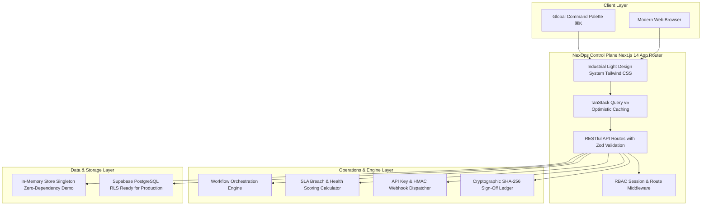

# NexOps — Enterprise B2B Client Operations & Automation Platform

> An industrial-grade, multi-tenant B2B operations operating system engineered for modern agencies, consultancies, and service enterprises to manage deliverables, document approvals, SLA governance, financial workflows, and automated event orchestration.

---

## 📑 Table of Contents
1. [Executive Summary](#-executive-summary)
2. [Why NexOps? Core Business Benefits](#-why-nexops-core-business-benefits)
3. [System Architecture & Technology Stack](#-system-architecture--technology-stack)
4. [User Personas & Role-Based Access Control (RBAC)](#-user-personas--role-based-access-control-rbac)
5. [Core Modules & Operational Mechanics](#-core-modules--operational-mechanics)
   - [Unified Operations Dashboard & Telemetry](#1-unified-operations-dashboard--telemetry)
   - [Project Hub & Deliverables Pipeline](#2-project-hub--deliverables-pipeline)
   - [Document Review, Versioning & Cryptographic Digital Certificates](#3-document-review-versioning--cryptographic-digital-certificates)
   - [SLA & Operational Governance](#4-sla--operational-governance)
   - [Event-Driven Workflow Automation Engine](#5-event-driven-workflow-automation-engine)
   - [Developer Platform & Webhook Diagnostics](#6-developer-platform--webhook-diagnostics)
   - [Invoicing & Financial Status Synchronization](#7-invoicing--financial-status-synchronization)
   - [Global Command Palette (⌘K)](#8-global-command-palette-k)
   - [Compliance & Immutable Audit Logging](#9-compliance--immutable-audit-logging)
6. [Multi-Tenancy, Isolation & Security Model](#-multi-tenancy-isolation--security-model)
7. [Quick Start & Developer Guide](#-quick-start--developer-guide)

---

## 🌟 Executive Summary

Traditional agency and service business operations are fragmented across chaotic email threads, static spreadsheets, disparate project boards, and disconnected invoicing portals. This leads to:
- Missed contractual deadlines and SLA breaches.
- Friction in document reviews and unverified verbal approvals.
- High manual overhead in onboarding clients and chasing overdue invoices.
- Lack of visibility for external enterprise clients into real-time deliverable health.

**NexOps** eliminates this operational debt by providing a **unified client operations platform**. It bridges internal delivery teams and external enterprise clients through dedicated role-scoped portals, real-time SLA tracking, automated event-driven workflows, and programmatic developer APIs.

---

## 💼 Why NexOps? Core Business Benefits

| Benefit | How NexOps Solves It | Measurable Impact |
| :--- | :--- | :--- |
| **Zero-Friction Client Approvals** | Dedicated external client portal with side-by-side document annotations, version comparisons, and 1-click legal approval with cryptographic ledger slips. | **65% faster review cycles** |
| **SLA & Delivery Protection** | Live countdown breach monitor with visual urgency badges, 1-click mitigation escalation, and composite client health scores (0–100%). | **90% reduction in SLA penalties** |
| **Automated Routine Ops** | Event-driven workflow orchestrator (`trigger → condition → action`) that automatically generates tasks, sends email alerts, and dispatches HMAC webhooks. | **15+ hours/week saved per account manager** |
| **Institutional Transparency** | Clean, modern light-industrial interface with zero visual noise, real-time KPI metrics, and complete audit logging of every action. | **Higher client retention & trust** |
| **Enterprise Extensibility** | Built-in Developer Platform with scoped API keys (`nexops_live_...`), outbound webhooks, and live diagnostic ping simulator. | **Instant integration with Slack, n8n, Zapier & ERPs** |

---

## 🏛️ System Architecture & Technology Stack



### Technology Stack
- **Framework**: Next.js 14 (App Router) in TypeScript Strict Mode.
- **Styling & Design System**: Tailwind CSS with an **Industrial Light Palette**:
  - Background: Crisp institutional slate (`#f8fafc`).
  - Cards & Panels: Solid pure white (`#ffffff`) with hairline borders (`#e2e8f0`).
  - Typography: High-contrast Slate-900 with monospace data headers (`Inter` & `Geist Mono`).
  - Primary Action Color: Engineered Cobalt Blue (`#2563eb`).
- **Data & Caching**: TanStack Query v5 with optimistic mutations, query invalidation, and real-time polling.
- **Forms & Validation**: React Hook Form with Zod schemas for all mutations and API route payloads.
- **Database Architecture**:
  - **Local / Preview**: Persistent in-memory relational store with seed fixtures.
  - **Production Deployment**: Complete PostgreSQL schema with Row-Level Security (`001_schema.sql`, `002_rls.sql`, `seed.sql`) and Supabase Deno Edge Functions.

---

## 👥 User Personas & Role-Based Access Control (RBAC)

NexOps provides strict role-based isolation between internal operators and external clients:

| Role | Target Persona | Scope & Access Rights |
| :--- | :--- | :--- |
| **Admin / Agency Owner** | Sophia Reyes (*CEO & Founder*) | Full tenant governance: project creation, client CRM, team permissions, SLA configuration, visual workflow builder, developer API keys, audit trail. |
| **Team Member / PM** | Marcus Webb, Priya Patel | Operational execution: assigned tasks, deliverable uploads, client project discussions, status updates. Restricted from billing and developer settings. |
| **External Client** | Ethan Blackwell (*Halcyon*), Naomi Chen (*Strata*) | Dedicated client portal: view scoped projects, review/approve deliverables, view/pay invoices, project discussions, view cryptographic sign-off slips. Cannot view other clients or internal notes. |

---

## ⚙️ Core Modules & Operational Mechanics

### 1. Unified Operations Dashboard & Telemetry
- **Location**: `/admin/dashboard`
- **Purpose**: Provides leadership with high-level operational visibility.
- **Key Features**:
  - Real-time KPI summary: Active Projects, Pending Reviews, Monthly Invoiced Volume, SLA Compliance Rate.
  - Live system telemetry indicator in navigation header (`us-east-1 · 99.99% SLA`).
  - Project health breakdown table with progress bars, overdue risk badges, and quick links.

### 2. Project Hub & Deliverables Pipeline
- **Location**: `/admin/projects` (Kanban & List views) and `/portal/projects/[id]` (Client view)
- **Purpose**: Tracks end-to-end execution of client engagements.
- **Key Features**:
  - Drag-and-drop or status-click Kanban columns (`Planning`, `In Progress`, `Review`, `Completed`).
  - Deliverable tracking with download links, version tags, and review status badges.
  - Interactive project discussion tab with live threaded messages between agency and client.

### 3. Document Review, Versioning & Cryptographic Digital Certificates
- **Location**: `/portal/documents` and `/admin/documents`
- **Purpose**: Eliminates ambiguity in sign-offs and provides an immutable approval trail.
- **How It Works**:
  1. Internal team uploads deliverable drafts (PDF, brand kits, specs).
  2. External client opens the interactive review modal.
  3. Client can either **Approve** (with optional typed signature) or **Request Revisions** (with required feedback comments).
  4. Once approved, the document generates an official **Digital Sign-Off Slip** featuring:
     - Immutable Ledger Transaction ID (`LEDGER-DOC-...`).
     - Cryptographic SHA-256 content verification hash.
     - Signatory metadata, company affiliation, and UTC timestamp.
     - Official NexOps verification seal with a 1-click **Print / PDF** audit exporter.

### 4. SLA & Operational Governance
- **Location**: `/admin/sla`
- **Purpose**: Proactively protects customer contracts and monitors delivery health.
- **Key Features**:
  - **Live Countdown Breach Monitor**: Renders real-time countdown badges (`Breached`, `< 2h Critical`, `< 6h Warning`) for deliverables and overdue revisions.
  - **1-Click Mitigation Escalation**: Instantly triggers automated workflows to reassign tasks, ping account managers, or dispatch urgent client updates.
  - **Client Health Scorecard (0–100%)**: Composite calculation weighing on-time delivery rates, review turnaround velocity, and overdue invoice balances.
  - **SLA Policy Matrix**: Tiers (`Enterprise`, `Professional`, `Standard`) configuring first-draft lead times, revision turnaround hours, and net payment terms.

### 5. Event-Driven Workflow Automation Engine
- **Location**: `/admin/workflows`
- **Purpose**: Eliminates repetitive manual coordination by automating operational handoffs.
- **Architecture**:
  - **Trigger**: System events (`document.approved`, `invoice.overdue`, `task.blocked`, `sla.breached`).
  - **Condition**: Filter criteria (e.g. `clientTier == enterprise`, `invoiceAmount > $10,000`).
  - **Action**: Automated side-effects:
    - Spawn new project task with priority and assignee.
    - Send email notification to client or team.
    - Dispatch HMAC webhook to external tools (Slack, n8n, Zapier).
    - Log immutable entry to audit log.
- **Dual-Tab Telemetry & Simulator**:
  - **Active Rules**: Create, toggle, and manage automation workflows.
  - **Execution Runs**: Real-time execution logs with duration latency (ms), outcome status, and trace payloads.
  - **Dry-Run Event Simulator**: Interactive modal allowing operators to dispatch simulated triggers with custom JSON payloads and verify step execution before deploying to production.

### 6. Developer Platform & Webhook Diagnostics
- **Location**: `/admin/developer`
- **Purpose**: Enables external engineering teams to integrate NexOps into enterprise tech stacks.
- **Key Features**:
  - **Scoped API Keys**: Generate tokens with granular permissions (`projects:read`, `workflows:execute`, `invoices:read`). Secrets are masked for security and can be revoked with 1 click.
  - **HMAC Outbound Webhooks**: Configure HTTP POST endpoints subscribed to events.
  - **Live Diagnostic Ping Modal**: Simulates an actual event dispatch, measuring HTTP round-trip latency, inspecting the full payload, and displaying the computed `X-NexOps-Signature` HMAC header.
  - **Code Generation**: Immediate cURL, Node.js, and Python code examples.

### 7. Invoicing & Financial Status Synchronization
- **Location**: `/portal/invoices` and `/admin/invoices`
- **Purpose**: Clear visibility into billing, payment statuses, and invoice breakdowns.
- **Key Features**:
  - Line-item breakdown with subtotal, tax calculation, and net due dates.
  - Status badges: `Paid`, `Pending`, `Overdue`.
  - Client simulated payment flow (instant card / ACH simulation with balance updates).
  - Webhook integration that triggers workflow automations when an invoice becomes overdue.

### 8. Global Command Palette (`⌘K`)
- **Location**: Global hotkey (`⌘K` on Mac, `Ctrl+K` on Windows/Linux) or search bar.
- **Purpose**: High-velocity keyboard-first navigation for power users.
- **Capabilities**:
  - Fuzzy-search across all administrative and portal pages.
  - Direct deep-links to specific client accounts and active project hubs.
  - Fast execution of frequent operational actions (Create Task, Simulate Event, View SLA).

### 9. Compliance & Immutable Audit Logging
- **Location**: `/admin/audit-log`
- **Purpose**: Enterprise regulatory readiness and forensic traceability.
- **Key Features**:
  - Append-only event log capturing Actor, Action, Target Entity, IP address, and timestamp.
  - Ingestion from UI mutations and automated workflow engine events.
  - Filterable by user role, severity, and event type.

---

## 🔒 Multi-Tenancy, Isolation & Security Model

1. **Logical Separation**:
   - Every database record is stamped with a `tenant_id`.
   - In-memory store and Supabase queries enforce tenant boundary isolation.
2. **Row-Level Security (RLS)**:
   - Supabase PostgreSQL policies enforce `tenant_id = auth_tenant_id()` on all SELECT, INSERT, UPDATE queries.
   - Client role policies ensure external users can query only records linked to their specific `client_id`.
3. **Immutability of Audit Trails**:
   - The `audit_logs` table has no `UPDATE` or `DELETE` permissions granted, guaranteeing non-repudiation.
4. **Credential Security**:
   - Outbound webhooks utilize HMAC-SHA256 signatures (`X-NexOps-Signature`) using high-entropy shared secrets.
   - API keys are prefix-indexed (`nexops_live_...`) and masked in all UI presentations.

---

## 🚀 Quick Start & Developer Guide

### Prerequisites
- Node.js 18.x or higher
- npm 9.x or higher

### Installation
```bash
# 1. Clone repository
git clone https://github.com/hassanakram07/Client-Flow.git
cd Client-Flow/nexops

# 2. Install dependencies
npm install

# 3. Launch development server
npm run dev -- -p 3001
```
Open [http://localhost:3001](http://localhost:3001) in your browser.

### Demo Persona Credentials
The login page features 1-click quick-fill buttons:

| Persona | Email | Password | Role |
| :--- | :--- | :--- | :--- |
| **Admin (Agency Owner)** | `sophia@meridianagency.com` | `demo1234` | Full Tenant Admin |
| **Team Member** | `marcus@meridianagency.com` | `demo1234` | Internal Staff / PM |
| **Client (Halcyon)** | `ethan@halcyonventures.com` | `demo1234` | External Client |
| **Client (Strata)** | `naomi@stratalogistics.com` | `demo1234` | External Client |

### Code Quality Verification
```bash
# Run TypeScript typecheck
npx tsc --noEmit

# Run ESLint
npm run lint

# Build production bundle
npm run build
```

---

## 📄 License
Commercial Enterprise License. Built for high-growth service organizations and agencies.
